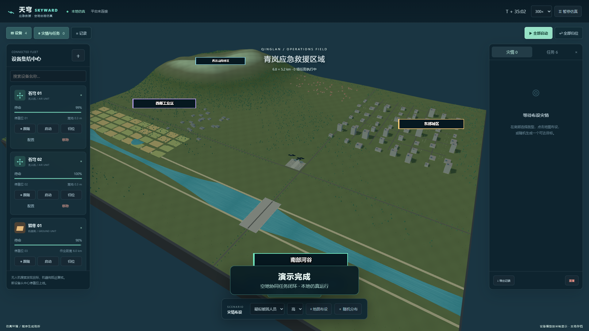

# 天穹 SKYWARD 空地协同仿真控制台

这是选题三“应急救援空地协同调度仿真平台”的设备仿真端。三维世界负责模拟无人机、机器狗、灾情与任务执行，后续业务平台负责设备台账、调度、事件管理、存储和检索。当前仍是纯前端本地仿真，Kafka、HDFS、MongoDB、Elasticsearch、Kibana 与 Nginx 尚未接入。

一个面向课程设计与演示答辩的三维应急救援调度控制台：无人机负责区域搜索与空中侦察，机器狗负责地面抵近、复核和现场处理。

## 在线演示视频

[▶ 在网页中直接播放 1080p 完整演示（约 86 秒）](https://guufish.github.io/drone-dog-disaster-sim/)

[](https://guufish.github.io/drone-dog-disaster-sim/)

视频包含全域态势、设备集结中心、无人机动态跟随、灾情注入、指定侦察、机器狗 A* 地面复核、处理中、已处理自动收起和全部归位。视频由无界面 Edge 自动录制，不包含桌面画面或个人信息。

## 功能概览

- 三维程序生成救援区域：山地、森林、河流、桥梁、农田、村庄、城区、工业区和设备集结中心。
- 无人机与机器狗设备编组：新增、配置、移除、启动、归位、跟随和实时设备信息卡。
- 灾情闭环：布设灾情 → 无人机发现 → 机器狗复核 → 处理完成 → 历史记录保留。
- 自主搜索：无人机按区域条带覆盖搜索，低电量自动返航补给后继续运行。
- 地面寻路：机器狗使用 40 米网格 A* 避开建筑、水域和陡坡，并支持最大作业距离配置。
- 视角控制：中心、全景、严格俯视、设备跟随和自由视角。
- 本地持久化：状态保存到浏览器 `localStorage`，同时保留本地协议事件出站记录。

## 运行

需要 Node.js 22.12+。在项目目录执行：

```powershell
npm install
npm run dev
```

开发地址默认为 http://localhost:5173。构建和测试：

```powershell
npm run build
npm test
npm run test:browser
npm run test:auto
npm run record:demo
```

两项浏览器测试和演示录制需要 Microsoft Edge，且开发服务器已经启动。`npm run test:browser` 验证交互流程，`npm run test:auto` 验证自主搜索、自由视角、归位和移动端布局。首次录制前执行 `npx playwright install ffmpeg` 安装 Playwright 自带的录制组件。

## 使用流程

1. 页面默认有 2 架无人机和 2 台机器狗，全部停靠在设备集结中心。新建设备会自动分配中心停靠位。
2. 在底部选择灾情类型与等级，点击地图布设，或随机生成一个地面可达目标。
3. 选择灾情后，可指定无人机执行空中侦察；也可以启动单台无人机进行自主分区搜索。
4. 无人机发现目标后，可指定机器狗复核。全部启动时，可用无人机自动搜索，可用机器狗等待并接收复核任务。
5. 机器狗到达后显示“处理中”，依次完成扫描采样与结果上报；完成后设备原地待命，灾情标记为“已处理”并在 8 秒后从当前态势自动收起，完整历史仍保留。
6. “全部归位”会取消执行中的任务，让设备沿路线返回各自停靠位；它不会清除灾情和历史记录。

设备卡片的“跟随”会持续锁定设备，同时允许鼠标自由旋转、滚轮缩放。自由视角从当前相机位置和朝向进入，默认速度为 30 m/s，可切换 10 / 30 / 100 m/s；WASD 移动，Q/E 调整高度，Shift 加速，鼠标转向，Esc 退出。

## 三维与仿真范围

世界范围为 6.8 × 5.2 km。场景包含山脊、沟谷、森林、平原、河道与河岸、桥梁、农田、村庄、城区、工业设施和设备集结中心。无人机采用带机腹相机的四旋翼 GLB；机器狗参考常见救援四足机器人，以圆角机身、前向传感器、关节电机和分段机械腿建模。模型和地形使用统一米制比例，远距离设备通过标签识别。无人机素材来源与授权见 `public/models/ASSETS.md`。

无人机速度为 18 m/s，机器狗速度为 2.2 m/s。无人机仅按最高实体表面保持净空，机器狗使用 40 米网格 A* 绕开建筑、水域和陡坡。这些行为适合课程演示，不代表真实飞控或连续运动规划。

本地状态每 1.5 秒写入 `sky-v4`。设备注册、遥测、事件发现、任务确认和任务结果同时写入本地协议事件列表，为后续接入服务保留统一边界。接口约定见 `PROTOCOL.md`，比例约定见 `SCALE.md`。

## 验证内容

- `simulation.test.mjs`：中心停靠位、公里级调度、桥梁寻路、越障净空、任务闭环、全部启动和全部归位。
- `check.cjs`：设备素材加载、设备新增、跟随缩放、指定派遣、处理结果、自动收起和本地持久化。
- `auto-check.cjs`：全部启动后的搜索处理、自由视角位置继承、俯视切换防滚转、全部归位和移动端布局。

## 项目结构

| 文件 | 作用 |
|---|---|
| `src.jsx` | React 控制台、设备面板、灾情面板和跟随信息卡 |
| `World.jsx` | Three.js 三维场景、模型、地图标记和相机控制 |
| `simulation.js` | 设备、灾情、任务和自主调度逻辑 |
| `terrain.js` | 地形、建筑、河流、碰撞和 A* 寻路 |
| `app.css` / `guide.css` / `follow.css` | 控制台、响应式布局和跟随信息卡样式 |
| `public/models/` | 无人机 GLB 及素材授权说明 |
| `record-demo.cjs` / `docs/` | 后台自动演练脚本、在线播放页、1080p WebM 成片与封面 |
| `PROTOCOL.md` | 仿真端与未来业务平台之间的消息协议约定 |

## 说明

这是程序生成的课程演示仿真，不是真实 GIS、飞控或机器人控制系统。当前中间件和后端服务尚未接入；无人机采用净空规则，机器狗采用网格 A*，均不代表生产级运动规划。三维无人机素材的作者、来源和 CC BY 3.0 授权信息见 `public/models/ASSETS.md`。
